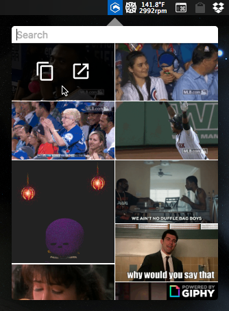
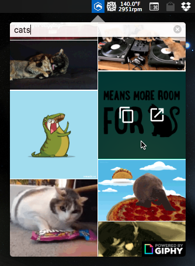

# GIFBar

> A system tray icon that helps you find the perfect GIF

## Download

[Current Release](https://github.com/dcrousso/GIFBar/releases/latest)

## Development

> Made with [Electron](http://electron.atom.io).

<table>
	<tr>
		<td>Init</td>
		<td><code>npm install</code></td>
	</tr>
	<tr>
		<td>Run</td>
		<td><code>npm start</code></td>
	</tr>
	<tr>
		<td>Build</td>
		<td><code>npm run build</code></td>
	</tr>
</table>

## License

MIT © [Devin Rousso](http://devinrousso.com)
